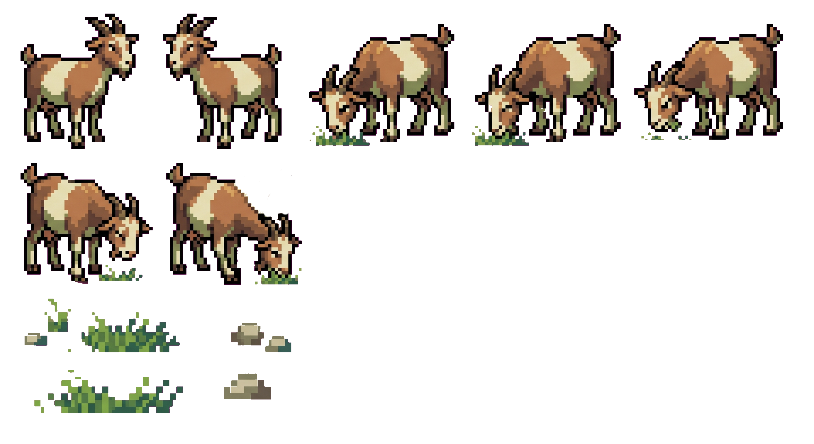

# 🐐 La Cabra - Mascota Virtual Interactiva

**La Cabra** es un componente interactivo y mascota virtual tipo "Zen" construido con React. No es solo un GIF animado; es un agente inteligente renderizado en un `<canvas>` con su propio motor de física, máquina de estados, entorno procedimental y un sentido del humor muy técnico.



## 🌟 Características

*   **Motor de Estados (State Machine)**: Transiciones orgánicas entre `IDLE`, `SLEEPING`, `EATING`, `ALERT`, `WALKING`, `RUNNING`, `JUMPING` y `ATTACKING`.
*   **Física y Arrastre**: Arrastra a la cabra por toda la pantalla. Si la dejas fuera de su sitio, volverá caminando sola después de un tiempo.
*   **Modo Caos**: Dale 10 clics rápidos para verla entrar en pánico y rebotar por toda la pantalla como el logo de un DVD.
*   **Entorno Procedimental**: Genera su propio bioma (pasto, flores, rocas) dinámicamente.
*   **Humor de Programador**: Suelta frases ingeniosas sobre hardware, software y desarrollo.
*   **Optimizado**: Renderizado en `<canvas>` a 60fps con procesamiento de imágenes al vuelo para transparencia.

## 🚀 Instalación Rápida

1. **Clona el repo:**
   ```bash
   git clone https://github.com/tu-usuario/la-cabra.git
   ```
2. **Instala dependencias:**
   ```bash
   npm install
   ```
3. **Inicia el desarrollo:**
   ```bash
   npm run dev
   ```

## ⚙️ Personalización

Puedes personalizar a la cabra pasando `props` al componente:

| Prop | Tipo | Default | Descripción |
| :--- | :--- | :--- | :--- |
| `phrases` | `string[]` | (internas) | Array de frases personalizadas. |
| `goatSize` | `number` | `300` | Tamaño en píxeles del componente. |
| `assetsPath` | `string` | `'/cabra/'` | Ruta a la carpeta de imágenes. |
| `initialPosition` | `object` | `{ bottom: '20px', right: '20px' }` | Posición CSS inicial. |

```jsx
<LaCabra 
  phrases={["¡Hola mundo!", "Tengo hambre..."]} 
  goatSize={200}
  initialPosition={{ top: '20px', left: '20px' }}
/>
```

## 📂 Estructura del Proyecto

*   `LaCabra.jsx`: Componente principal de React y motor de renderizado.
*   `GoatController.js`: El "cerebro" (lógica de estados y diálogos) en Vanilla JS.
*   `LaCabra.css`: Estilos, animaciones y posicionamiento.
*   `/public/cabra/`: Directorio con los sprites y assets visuales.

## 🛠️ Tecnologías

*   React 19
*   Vite
*   Vanilla CSS
*   Canvas API

## 📜 Licencia

Este proyecto está bajo la Licencia MIT. Consulta el archivo [LICENSE](LICENSE) para más detalles.

---
Hecho con 🐐 por kevink1xwl
